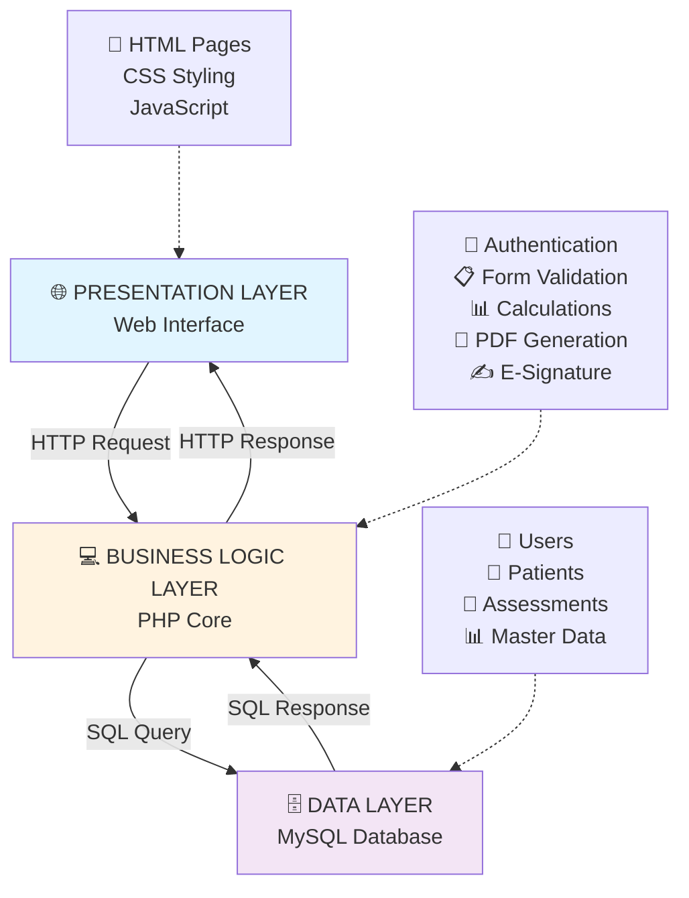
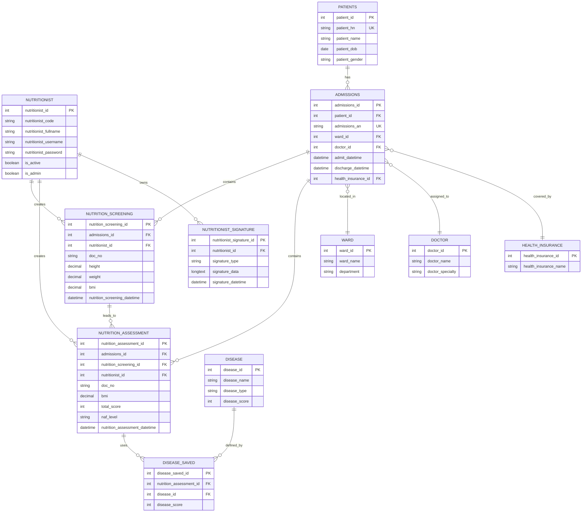
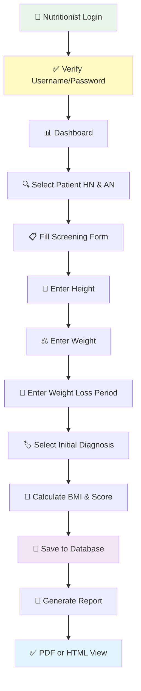
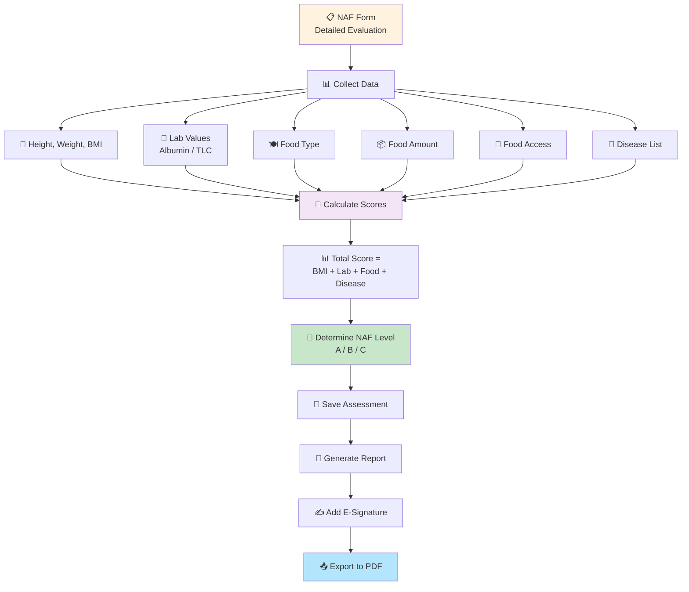

# KPH NAS System Architecture Documentation

**Version**: 1.0  
**Date**: February 26, 2026  
**System**: King Prajadhipok Hospital - Nutrition Assessment System (KPH NAS)

---

## 📋 System Overview

ระบบ **KPH NAS** เป็นระบบจัดการและประเมินภาวะโภชนาการ (Nutrition Assessment System) สำหรับผู้ป่วยในโรงพยาบาล โดยใช้สถาปัตยกรรม **3-Tier Architecture**



---

## 📂 Project Folder Structure

```
kph_nas_project/
│
├── 📄 Core PHP Files
│   ├── index.php                    # Dashboard หลัก
│   ├── login.php                    # ล็อกอิน
│   ├── logout.php                   # ล็อกเอาท์
│   ├── connect_db.php               # Database Connection (PDO)
│   │
│   ├── nutrition_screening_form.php          # Screening Form
│   ├── nutrition_screening_form_save.php     # Save Screening Data
│   ├── nutrition_screening_form_view.php     # View Screening Results
│   ├── nutrition_screening_form_report.php   # PDF Report
│   │
│   ├── nutrition_alert_form_report.php       # Alert Report
│   ├── nutrition_form_history.php            # History View
│   ├── patient_profile.php                   # Patient Profile
│   ├── electronic_sign.php                   # Digital Signature
│   │
│   └── admin/                       # Admin Module
│       ├── admin_dashboard.php
│       ├── admin_users.php
│       ├── admin_master_data.php
│       └── ...
│
├── 📂 html/ (HTML Templates)
│   ├── index.html
│   ├── nutrition_screening_form.html
│   └── ...
│
├── 📂 css/ (Stylesheets)
│   └── *.css
│
├── 📂 database/
│   └── kph_nas_db.sql              # Complete Database Schema
│
├── 📂 vendor/
│   ├── autoload.php
│   └── mpdf/                       # PDF Generation Library
│
└── 📂 tmp/
    └── mpdf/                       # Temporary PDF Files
```

---

## 🗄️ Database Entity Relationship Diagram



### 1️⃣ **nutritionist** - User Management
```sql
CREATE TABLE nutritionist (
  nutritionist_id INT PRIMARY KEY AUTO_INCREMENT,
  nutritionist_code VARCHAR(50),           -- License Number
  nutritionist_fullname VARCHAR(255),      -- Full Name
  nutritionist_gender ENUM('ชาย','หญิง'), -- Gender
  nutritionist_position VARCHAR(100),      -- Position
  nutritionist_username VARCHAR(100),      -- Login Username
  nutritionist_password VARCHAR(255),      -- Password Hash
  is_active TINYINT(1),                    -- Account Status
  is_admin TINYINT(1)                      -- Admin Privilege
);
```

### 2️⃣ **patients** - Patient Demographics
```sql
CREATE TABLE patients (
  patient_id INT PRIMARY KEY AUTO_INCREMENT,
  patient_hn VARCHAR(20),                  -- Hospital Number
  patient_name VARCHAR(255),               -- Full Name
  patient_dob DATE,                        -- Date of Birth
  patient_age INT,                         -- Age
  patient_gender VARCHAR(50),              -- Gender
  patient_id_card VARCHAR(20),             -- ID Card Number
  patient_phone VARCHAR(20),               -- Phone Number
  patient_drug_allergy TEXT                -- Drug Allergies
);
```

### 3️⃣ **admissions** - Hospital Admission Records
```sql
CREATE TABLE admissions (
  admissions_id INT PRIMARY KEY AUTO_INCREMENT,
  admissions_an VARCHAR(20),               -- Admission Number
  patient_id INT,                          -- FK: patients
  health_insurance_id INT,                 -- FK: health_insurance
  admit_datetime DATETIME,                 -- Admission Date/Time
  discharge_datetime DATETIME,             -- Discharge Date/Time
  ward_id INT,                             -- FK: ward
  bed_number VARCHAR(10),                  -- Bed Number
  doctor_id INT,                           -- FK: doctor
  status VARCHAR(50),                      -- 'Admitted' or 'Discharged'
  FOREIGN KEY (patient_id) REFERENCES patients(patient_id)
);
```

### 4️⃣ **nutrition_screening** - Screening Assessment
```sql
CREATE TABLE nutrition_screening (
  nutrition_screening_id INT PRIMARY KEY AUTO_INCREMENT,
  doc_no VARCHAR(20),                      -- Document Number
  admissions_an VARCHAR(20),               -- Admission Number
  patient_hn VARCHAR(20),                  -- Patient HN
  nutritionist_id INT,                     -- FK: nutritionist
  nutrition_screening_datetime DATETIME,   -- Assessment Date/Time
  nutrition_screening_seq INT,             -- Sequence Number
  present_weight DECIMAL(5,2),             -- Current Weight (kg)
  normal_weight DECIMAL(5,2),              -- Normal Weight (kg)
  height DECIMAL(5,2),                     -- Height (cm)
  bmi DECIMAL(5,2),                        -- BMI Value
  weight_loss_percent DECIMAL(5,2),        -- Weight Loss %
  weight_loss_period VARCHAR(50),          -- Period (1 week, 1 month, etc)
  initial_diagnosis VARCHAR(255)           -- Initial Diagnosis
);
```

### 5️⃣ **nutrition_assessment** - Detailed Assessment (NAF)
```sql
CREATE TABLE nutrition_assessment (
  nutrition_assessment_id INT PRIMARY KEY AUTO_INCREMENT,
  doc_no VARCHAR(20),                      -- NAF Document Number
  naf_seq INT,                             -- Assessment Sequence
  admissions_an VARCHAR(20),               -- Admission Number
  patient_hn VARCHAR(20),                  -- Patient HN
  nutritionist_id INT,                     -- FK: nutritionist
  nutrition_assessment_datetime DATETIME,  -- Assessment Date/Time
  
  -- Physical Measurements
  height_measure DECIMAL(5,2),             -- Measured Height
  weight DECIMAL(5,2),                     -- Weight
  bmi DECIMAL(5,2),                        -- BMI
  bmi_score INT,                           -- BMI Risk Score
  
  -- Lab Values (if no weight available)
  is_no_weight TINYINT(1),                 -- Cannot weigh flag
  lab_method VARCHAR(50),                  -- Albumin or TLC
  albumin_val DECIMAL(4,2),                -- Albumin value
  tlc_val DECIMAL(10,2),                   -- TLC value
  lab_score INT,                           -- Lab Risk Score
  
  -- Food & Intake Assessment
  food_type_id INT,                        -- FK: food_type
  food_amount_id INT,                      -- FK: food_amount
  food_access_id INT,                      -- FK: food_access
  
  -- Results
  total_score INT,                         -- Total Risk Score
  naf_level VARCHAR(50),                   -- NAF Level (A, B, C)
  created_at DATETIME
);
```

### 6️⃣ **disease_saved** - Diseases Recorded
```sql
CREATE TABLE disease_saved (
  disease_saved_id INT PRIMARY KEY AUTO_INCREMENT,
  nutrition_assessment_id INT,             -- FK: nutrition_assessment
  disease_id INT,                          -- FK: disease
  disease_other_name VARCHAR(255),         -- Other disease names
  disease_score INT                        -- Disease risk score
);
```

### 7️⃣ Master Data Tables
```sql
-- Food Types
CREATE TABLE food_type (
  food_type_id INT PRIMARY KEY,
  food_type_label VARCHAR(255),    -- 'อาหารน้ำๆ', 'อาหารเหลวๆ', etc
  food_type_score INT              -- Risk score
);

-- Food Amount
CREATE TABLE food_amount (
  food_amount_id INT PRIMARY KEY,
  food_amount_label VARCHAR(255),  -- 'กินน้อยมาก', 'กินเท่าปกติ'
  food_amount_score INT
);

-- Food Access
CREATE TABLE food_access (
  food_access_id INT PRIMARY KEY,
  food_access_label VARCHAR(255),  -- 'นอนติดเตียง', 'ปกติ'
  food_access_score INT
);

-- Diseases
CREATE TABLE disease (
  disease_id INT PRIMARY KEY,
  disease_name VARCHAR(255),       -- Disease name
  disease_type VARCHAR(100),       -- Severity level
  disease_score INT                -- Risk score
);

-- Insurance
CREATE TABLE health_insurance (
  health_insurance_id INT PRIMARY KEY,
  health_insurance_name VARCHAR(100)  -- 'บัตรทอง', 'ประกันสังคม'
);
```

---

## 🔄 Key Business Workflows

### Workflow 1: Nutrition Screening



### Workflow 2: Nutrition Assessment (NAF)



---

## 💻 PHP Code Patterns

### Pattern 1: Database Connection
```php
<?php
// connect_db.php
try {
    $conn = new PDO(
        "mysql:host=localhost;dbname=kph_nas_db;charset=utf8mb4",
        "root",
        ""
    );
    $conn->setAttribute(PDO::ATTR_ERRMODE, PDO::ERRMODE_EXCEPTION);
} catch (PDOException $e) {
    die("Connection failed: " . $e->getMessage());
}
?>
```

### Pattern 2: User Authentication
```php
<?php
session_start();
require_once 'connect_db.php';

if ($_SERVER["REQUEST_METHOD"] == "POST") {
    $username = trim($_POST['username'] ?? '');
    $password = trim($_POST['password'] ?? '');
    
    // Query database
    $sql = "SELECT * FROM nutritionist WHERE nutritionist_username = ? AND is_active = 1";
    $stmt = $conn->prepare($sql);
    $stmt->execute([$username]);
    $user = $stmt->fetch(PDO::FETCH_ASSOC);
    
    // Verify password
    if ($user && password_verify($password, $user['nutritionist_password'])) {
        $_SESSION['nutritionist_id'] = $user['nutritionist_id'];
        $_SESSION['nutritionist_fullname'] = $user['nutritionist_fullname'];
        $_SESSION['is_admin'] = $user['is_admin'];
        header("Location: index.php");
        exit;
    } else {
        $error_msg = "Username or password incorrect";
    }
}
?>
```

### Pattern 3: Save Screening Data
```php
<?php
require_once 'connect_db.php';
session_start();

// Validate input
$patient_hn = trim($_POST['patient_hn'] ?? '');
$admissions_an = trim($_POST['admissions_an'] ?? '');
$height = floatval($_POST['height'] ?? 0);
$weight = floatval($_POST['weight'] ?? 0);

// Calculate BMI
$bmi = ($height > 0) ? ($weight / (($height / 100) ** 2)) : null;

// Insert into database
try {
    $sql = "INSERT INTO nutrition_screening 
            (doc_no, admissions_an, patient_hn, nutritionist_id, 
             nutrition_screening_datetime, height, weight, bmi)
            VALUES (?, ?, ?, ?, NOW(), ?, ?, ?)";
    
    $stmt = $conn->prepare($sql);
    $stmt->execute([
        $doc_no,
        $admissions_an,
        $patient_hn,
        $_SESSION['nutritionist_id'],
        $height,
        $weight,
        $bmi
    ]);
    
    $screening_id = $conn->lastInsertId();
    echo json_encode(['success' => true, 'screening_id' => $screening_id]);
    
} catch (PDOException $e) {
    echo json_encode(['success' => false, 'error' => 'Database error']);
    error_log($e->getMessage());
}
?>
```

### Pattern 4: Query Assessment with Related Data
```php
<?php
$sql = "SELECT 
          ns.nutrition_screening_id,
          ns.doc_no,
          ns.nutrition_screening_datetime,
          ns.height,
          ns.weight,
          ns.bmi,
          p.patient_hn,
          p.patient_name,
          a.admissions_an,
          a.ward_id,
          nt.nutritionist_fullname
        FROM nutrition_screening ns
        JOIN admissions a ON ns.admissions_an = a.admissions_an
        JOIN patients p ON a.patient_id = p.patient_id
        JOIN nutritionist nt ON ns.nutritionist_id = nt.nutritionist_id
        WHERE p.patient_hn = ?
        ORDER BY ns.nutrition_screening_datetime DESC";

$stmt = $conn->prepare($sql);
$stmt->execute([$patient_hn]);
$results = $stmt->fetchAll(PDO::FETCH_ASSOC);
?>
```

### Pattern 5: Calculate NAF Score
```php
<?php
function calculateNAFScore($bmi_score, $lab_score, $food_type_score, 
                          $food_amount_score, $food_access_score, 
                          $diseases_score) {
    $total = $bmi_score + $lab_score + $food_type_score + 
             $food_amount_score + $food_access_score + $diseases_score;
    
    // Determine NAF Level
    if ($total >= 20) {
        return ['level' => 'NAF C', 'score' => $total];
    } elseif ($total >= 12) {
        return ['level' => 'NAF B', 'score' => $total];
    } else {
        return ['level' => 'NAF A', 'score' => $total];
    }
}

// Save calculation
$naf_result = calculateNAFScore(2, 0, 1, 0, 0, 6);

$sql = "INSERT INTO nutrition_assessment 
        (total_score, naf_level, nutrition_assessment_datetime) 
        VALUES (?, ?, NOW())";
$stmt = $conn->prepare($sql);
$stmt->execute([$naf_result['score'], $naf_result['level']]);
?>
```

### Pattern 6: Generate PDF Report
```php
<?php
require_once 'vendor/autoload.php';

// Fetch assessment data
$sql = "SELECT * FROM nutrition_assessment WHERE nutrition_assessment_id = ?";
$stmt = $conn->prepare($sql);
$stmt->execute([$assessment_id]);
$data = $stmt->fetch(PDO::FETCH_ASSOC);

// Create PDF
$mpdf = new \Mpdf\Mpdf();

$html = "
<style>
  body { font-family: dejaVuSansCondensed; }
  h2 { text-align: center; }
  table { width: 100%; border-collapse: collapse; }
  td { padding: 5px; border: 1px solid #ccc; }
</style>
<h2>Nutrition Assessment Report (NAF)</h2>
<table>
  <tr>
    <td><b>Document Number:</b></td>
    <td>{$data['doc_no']}</td>
  </tr>
  <tr>
    <td><b>Patient HN:</b></td>
    <td>{$data['patient_hn']}</td>
  </tr>
  <tr>
    <td><b>Assessment Level:</b></td>
    <td style='background-color: #ffffcc;'><b>{$data['naf_level']}</b></td>
  </tr>
  <tr>
    <td><b>Total Score:</b></td>
    <td>{$data['total_score']}</td>
  </tr>
</table>";

$mpdf->WriteHTML($html);
$mpdf->Output('NAF_' . $assessment_id . '.pdf', 'D');
?>
```

---

## 🔐 Security Features

### 1. Authentication
- ✅ Username/Password with hash verification
- ✅ Session-based login tracking
- ✅ Logout functionality

### 2. Authorization
- ✅ Role-based access (nutritionist vs admin)
- ✅ is_active flag for account status
- ✅ Session checks on pages

### 3. Data Protection
- ✅ PDO prepared statements (SQL injection prevention)
- ✅ UTF-8 character encoding
- ✅ Input validation & sanitization

### 4. Document Security
- ✅ Digital signature support
- ✅ Document numbering system
- ✅ Audit trail via created_at timestamps

---

## 📊 Key Features

| Feature | Description | Status |
|---------|-------------|--------|
| Nutrition Screening | Basic rapid assessment | ✅ Active |
| Nutrition Assessment (NAF) | Detailed scoring system | ✅ Active |
| Disease Management | Link diseases to assessments | ✅ Active |
| Food Options | Track food intake patterns | ✅ Active |
| PDF Reports | Generate printable reports | ✅ Active |
| Digital Signature | E-signature on documents | ✅ Active |
| Patient History | View assessment history | ✅ Active |
| Admin Management | User & master data management | ✅ Active |

---

## 🛠️ Technology Stack

| Component | Technology |
|-----------|-----------|
| **Frontend** | HTML5, CSS3, JavaScript |
| **Backend** | PHP 8.2.12 |
| **Database** | MySQL 10.4.32 (MariaDB) |
| **ORM/Query** | PDO (PHP Data Objects) |
| **PDF Library** | mPDF |
| **Server** | Apache (XAMPP) |
| **Charset** | UTF-8 / UTF-8MB4 |

---

## 📈 Current Data Volume

```
Users (nutritionist):           4 active
Patients:                       50+
Admissions:                     70
Screening Assessments:          ~37
NAF Assessments:                ~37
Assessment Records:             100+
```

---

## 🎯 NAF Assessment Scoring Guide

### BMI Score
- < 17: 2 points
- 17-20: 1 point
- > 20: 0 points

### Lab Values (if cannot weigh)
- Albumin < 2.5 g/dL: 3 points
- TLC < 800: 3 points

### Food Type Score
- Liquid food: 2 points
- Semi-liquid: 1 point
- Normal food: 0 points

### Food Amount Score
- Very little: 2 points
- Less: 1 point
- Normal: 0 points

### Food Access Score
- Bed-ridden: 2 points
- Some help: 1 point
- Normal: 0 points

### Disease Score
- Minor severity: 3 points
- Major severity: 6 points

### Total Score → NAF Level
- **NAF A**: Score 0-10 (Low risk)
- **NAF B**: Score 11-19 (Moderate risk)
- **NAF C**: Score 20+ (High risk)

---

## 📝 Document Numbering System

```
Screening:      SPENT-[HN]-[SEQ]
                Example: SPENT-6710001-001

Assessment:     NAF-[HN]-[SEQ]
                Example: NAF-6710001-001
```

---

## 🔗 Module Dependencies

```
index.php (Dashboard)
  ├── nutrition_screening_form.php
  │   ├── connect_db.php
  │   └── [HTML] nutrition_screening_form.html
  │   └── [View] nutrition_screening_form_view.php
  │   └── [Report] nutrition_screening_form_report.php
  │
  ├── nutrition_assessment_form.php (NAF)
  │   ├── connect_db.php
  │   ├── calculation logic
  │   └── disease selection (disease_saved)
  │
  ├── patient_profile.php
  │   ├── nutrition_form_history.php
  │   └── linked assessments
  │
  ├── electronic_sign.php
  │   └── nutritionist_signature table
  │
  └── admin/
      ├── admin_dashboard.php
      ├── admin_users.php
      └── admin_master_data.php
```

---

## ✅ Deployment Checklist

- [ ] Database imported (kph_nas_db.sql)
- [ ] Apache server configured
- [ ] PHP 8.2+ installed
- [ ] mPDF library available
- [ ] Session handling enabled
- [ ] Temporary folder created (/tmp/mpdf)
- [ ] Database credentials verified (connect_db.php)
- [ ] Test user created (nutritionist table)

---

**Last Updated**: February 26, 2026  
**System Version**: 1.0  
**Database Status**: Active (Feb 26, 2026 07:56 AM)
